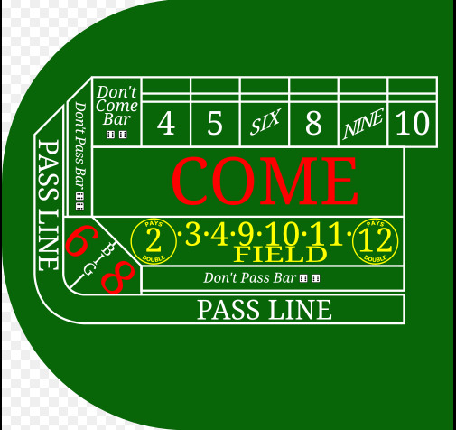

# Simulating Craps in Python: A Comparison of Real Play to Expected Outcomes

Ever wondered what it's like to gamble? Well in this tutorial we will simulate the game "Craps" in Python and compare the results to real-world data that I have collected from about 3 hours of actual casino play. 

By the end of this blog you'll be able to see how probability and simulation explain why the house always wins in the long run, even if you're lucky in the short term. 

Simulation is a powerful tool in data science because it lets us model complex real-world processes with just a few lines of code. By running thousands of trials in seconds, we can see the patterns that would take hours—or even days—to collect manually. Whether it’s casinos, finance, or scientific experiments, simulation helps us bridge the gap between theory and practice.

  
*Example of a craps table.*  


## A Speedrun of the Rules of Craps

Craps is a dice game played with 2 six-sided dice. While there are a lot of rules and nuances in craps, I will be keeping it to the most basic level for quick understanding. The most common bet is called the **Pass Line Bet** which works like this:

- On the first roll (the "come-out roll"):
  - A **7 or 11** means you win immediately.
  - A **2, 3, or 12** means you lose immediately.
  - Any other number (4, 5, 6, 8, 9, 10) becomes the "point."

- Once a point is set:
  - You keep rolling until either the **point repeats** (you win) or a **7 appears** (you lose).

While the point is set at a number you can make a **place bet** where you can bet on a specific number (4, 5, 6, 8, 9, 10) to be rolled before the **7** is rolled. 
The most common are betting on **6** or **8**, because they have higher chances of appearing (5 out of 36 dice combinations).  
If your number rolls before a 7, you win; if a 7 rolls first, you lose.  

This simple structure makes Craps great for simulation: the rules are easy to code, but the outcomes depend on probability and luck.

We’ll keep our simulation focused on the Pass Line bet, but I’ll mention my own side bets on 6 and 8 when comparing to real casino play.

For a full breakdown of the rules, see [Craps Basics at the Venetian Casino](https://www.venetianlasvegas.com/resort/casino/table-games/craps-basic-rules.html).


## My Casino Data

Over about 3 hours of play, I recorded the outcome of each dice roll at the craps table.  
Here’s a rough summary of the outcomes I observed (out of ~320 total rolls):

| Dice Total | Count |
|------------|-------|
| 2          | 9     |
| 3          | 18    |
| 4          | 27    |
| 5          | 36    |
| 6          | 44    |
| 7          | 54    |
| 8          | 46    |
| 9          | 38    |
| 10         | 28    |
| 11         | 15    |
| 12         | 5     |

This gives us a rough distribution of the totals rolled. Later, we’ll compare this to the expected probabilities from simulation.


## Time to Simulate Craps in Python

Now we will look at a simple Craps simulator
I am just going to focus on the **Pass Line Bet**, but I will also keep track of how often each number appears and we can compare it to my data. 


```python
import random
from collections import Counter

def roll_dice():
    return random.randint(1, 6) + random.randint(1, 6)

def simulate_passline(rounds=100000):
    wins = 0
    losses = 0
    roll_counts = Counter()

    for _ in range(rounds):
        first = roll_dice()
        roll_counts[first] += 1

        # Come-out roll rules
        if first in [7, 11]:
            wins += 1
        elif first in [2, 3, 12]:
            losses += 1
        else:
            # A point is established
            point = first
            while True:
                roll = roll_dice()
                roll_counts[roll] += 1
                if roll == point:
                    wins += 1
                    break
                elif roll == 7:
                    losses += 1
                    break

    return wins, losses, roll_counts

# Run the simulation
wins, losses, roll_counts = simulate_passline(100000)

print(f"Wins: {wins}, Losses: {losses}, Win %: {wins / (wins + losses):.3f}")
print("Sample of roll counts:")
for total in range(2, 13):
    print(total, roll_counts[total])
```

## Comparing Real vs Simulated Results

Here’s a side-by-side comparison of my data against the simulation (100,000 trials).
 

| Dice Total | Casino % | Simulated % |
|------------|----------|-------------|
| 2          | 2.81%    | 2.781% |
| 3          | 5.63%    | 5.564% |
| 4          | 8.44%    | 8.322% |
| 5          | 11.25%   | 10.955% |
| 6          | 13.75%   | 13.905% |
| 7          | 16.88%   | 16.795% |
| 8          | 14.38%   | 13.772% |
| 9          | 11.88%   | 11.245% |
| 10         | 8.75%    | 8.480% |
| 11         | 4.69%    | 5.471% |
| 12         | 1.56%    | 2.710% |

The simulated percentages line up very closely with the theoretical probabilities of two dice.  
My real data has more variation because 320 rolls is a relatively small sample, but the overall pattern is consistent.


## Conclusion

By comparing a few hours of real casino play to a large Python simulation, we can see how the math of Craps plays out in practice.  
The distribution of my real dice rolls closely matched the theoretical probabilities, even though short-term luck caused some swings.  

The simulation doesn’t just show the dice totals — it also keeps track of how many times you win versus how many times you lose.  
This makes it easy to see how close your experience lines up with the true odds: in the long run, the house edge ensures you’ll lose slightly more often than you win.

## Call to Action

Now that you’ve seen how to simulate Craps and compare it to real play, try running the Python code yourself.  
Watch the output to see not only the distribution of dice totals but also how many times you win versus lose.  
Experiment with more or fewer trials, try different bankrolls or betting strategies, and see how the outcomes shift.  
Whether you test it in an online simulator, explore with code, or bet your child's college fund, you’ll quickly see how hard it is to beat the house edge. Good luck!
